## SQL Practise 2 - Business Operation Analysis

*Database:	[db_create](https://github.com/HTean/Analysis/blob/main/Data2/Database%20Creation.md)*

**----------------------------------- Database -----------------------------------**
- Schema:
<br />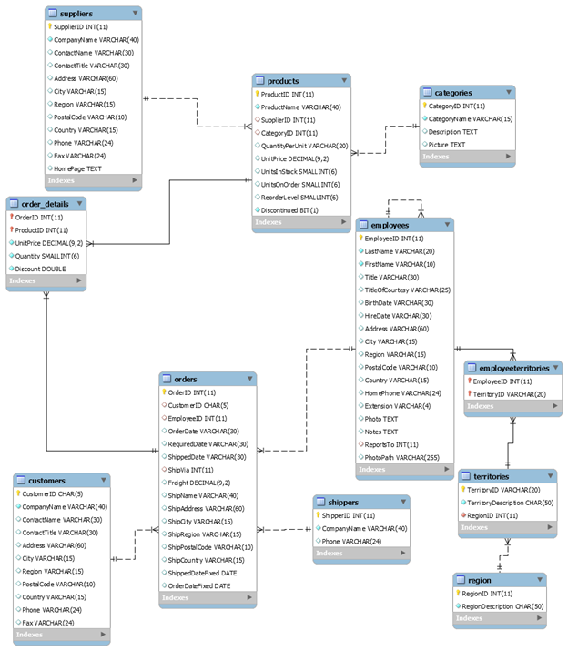

**----------------------------------- Analysis -----------------------------------**
- Design and create a data warehouse for the provided database
```
CREATE OR REPLACE VIEW project AS
SELECT order_details.OrderID, orders_query.EmployeeName, order_details.ProductID, ProductName, prod_query.CategoryName, prod_query.ProdUnitPrice, 
order_details.UnitPrice AS OrderUnitPrice, Quantity AS OrderQuantity, Discount AS OrderDiscount, ROUND(order_details.UnitPrice*Quantity*(1-Discount),2) AS Subtotal,STR_TO_DATE(OrderDate, "%m/%d/%Y") AS OrderDate, 
STR_TO_DATE(RequiredDate, "%m/%d/%Y") AS RequiredDate, STR_TO_DATE(ShippedDate, "%m/%d/%Y") AS ShippedDate, orders_query.ShipperName, orders_query.CustomerID, orders_query.Customer_CompanyName AS CustomerName, 
orders_query.Cust_Country AS CustomerCountry, prod_query.SupplierName, prod_query.SupplierCountry
FROM order_details
JOIN 
(SELECT OrderID, OrderDate, RequiredDate, ShippedDate, cust_query.CompanyName AS Customer_CompanyName, 
cust_query.Country AS Cust_Country, CONCAT(emp_query.LastName, ", ", emp_query.FirstName) AS EmployeeName,
ship_query.CompanyName AS ShipperName, cust_query.CustomerID
FROM orders
	JOIN 	(SELECT CustomerID, CompanyName, Country
			FROM customers) AS cust_query
		ON orders.CustomerID = cust_query.CustomerID
	JOIN 	(SELECT EmployeeID, employees.LastName, employees.FirstName
			FROM employees) AS emp_query
		ON orders.EmployeeID = emp_query.EmployeeID
 	JOIN 	(SELECT ShipperID, CompanyName
			FROM shippers) AS ship_query
		ON orders.ShipVia = ship_query.ShipperID) AS orders_query
        ON order_details.OrderID = orders_query.OrderID
JOIN 
(SELECT ProductID, categories.CategoryName, ProductName, UnitPrice AS ProdUnitPrice, Discontinued, suppliers.CompanyName AS SupplierName, suppliers.Country AS SupplierCountry
FROM products
JOIN categories ON products.CategoryID = categories.CategoryID
JOIN suppliers ON products.SupplierID = suppliers.SupplierID) AS prod_query
ON order_details.ProductID = prod_query.ProductID;
```
*Data warehouse screenshot:*
<br />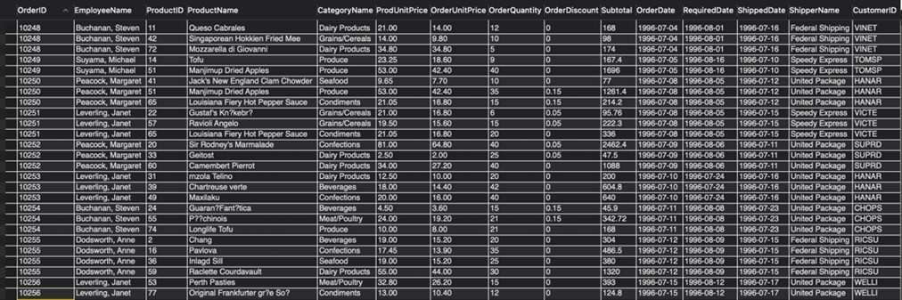

- Create eight SQL queries on your data warehouse that answer interesting questions
1. What is the total Revenue for each category? And which category has the highest revenue overall?[^1]

[^1]:This is the table showing the total revenue for each category, and we found out that category Beverages has the highest revenue overall. 

```
SELECT CategoryName, round(sum(Subtotal),2) as Revenue
FROM project
GROUP BY CategoryName;
```
*Q1 Screenshot:*
<br />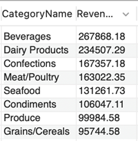

2. Who can get promotions considering their total orders and revenue they made?[^2]
[^2]:If this company considers promoting one employee, this person should be Peacock, Margaret who achieved the highest orders and the highest revenue.
```
SELECT  Employee_info.EmployeeName, Title, total_Order, Revenue
FROM (SELECT CONCAT(LastName, ", ", FirstName) AS EmployeeName, Title FROM employees) as employees
JOIN (SELECT EmployeeName, COUNT(DISTINCT(OrderID)) as total_Order, ROUND(SUM(Subtotal),2) as Revenue
FROM project
GROUP BY EmployeeName) as Employee_info
ON employees.EmployeeName = Employee_info.EmployeeName;
```
*Q2 Screenshot:*
<br />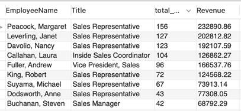

3.	For our biggest customer, what is his consumption preference?[^3]
[^3]:This is the table showing the distribution of category of our biggest customer. We can use same way to explore our big customers’ consumption habit and our position. For instance, we can see here, about half of our biggest customer’s consumption is on beverages and confections, that means we probably better than other company in terms of these 2 categories and we need to keep it.
```
SELECT firstCus.CustomerName, CategoryName, totalRevenue, CONCAT(ROUND(totalRevenue/Sum*100, 2),'%') AS Percent
FROM (SELECT CustomerName, CategoryName, SUM(subtotal) AS totalRevenue FROM project
WHERE CustomerName = (SELECT CustomerName FROM (SELECT CustomerName, SUM(Subtotal) AS totalRevenue
						                        FROM project
						                        GROUP BY CustomerName
                                                ORDER BY totalRevenue DESC
                                                LIMIT 1) AS firstR)
GROUP BY CategoryName
ORDER BY totalRevenue DESC) AS firstCus
JOIN (SELECT CustomerName, SUM(subtotal) AS Sum FROM project GROUP BY CustomerName HAVING CustomerName = (SELECT CustomerName FROM (SELECT CustomerName, SUM(Subtotal) AS totalRevenue
																								   FROM project
						                                                                           GROUP BY CustomerName
                                                                                                   ORDER BY totalRevenue DESC
                                                                                                   LIMIT 1) AS firstR)) AS sumR
ON firstCus.CustomerName = sumR.CustomerName
```
*Q3 Screenshot:*
<br />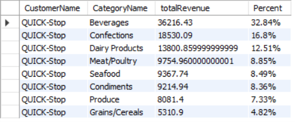

4.	Customer Loyalty: which customer has the greatest number of orders? [^4]
[^4]:This table shows individual customers’ total order request amount. The total amount is 830, and Save-a-lot Markets purchased the most times. Combine with the 3rd question, we should pay extra attention to maintain the relationship with these customers.
```
SELECT CustomerName, COUNT(DISTINCT(OrderID)) as total_order
FROM project
GROUP BY CustomerName WITH ROLLUP
ORDER BY CustomerName DESC; 
```
*Q4 Screenshot:*
<br />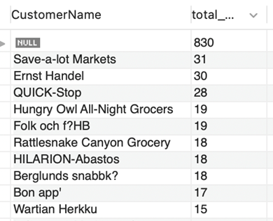

5.	Which category is bought the most by different countries?  [^5]
[^5]:This table shows the top category for different countries, we can see it varies from countries to countries. So, we can adjust our products strategy in terms of what country it is. For example, in Argentina, the most popular category is confections, so we can make more confection ads to Argentina clients.
```
SELECT table1.CustomerCountry,CategoryName,Category_order_total
FROM (SELECT CustomerCountry, CategoryName, COUNT(CategoryName) as Category
FROM project
GROUP By CustomerCountry, CategoryName) as table1
JOIN 
(SELECT CustomerCountry, Max(Category) as Category_order_total
FROM (SELECT CustomerCountry, CategoryName, COUNT(CategoryName) as Category
FROM project
GROUP By CustomerCountry, CategoryName) as country_category
GROUP By CustomerCountry) as table2
ON table1.CustomerCountry=table2.CustomerCountry and table1.Category=table2.Category_order_total;
```
<br />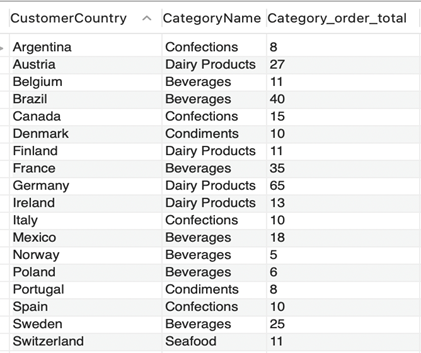

6.	How does discounts affect the sales of each category?[^6]
[^6]:In beverage, discount does have some effect on orders, but overall, we found out that the sales of each category were not affected by the discount. 
```
SELECT CategoryName, OrderDiscount, COUNT(DISTINCT(OrderID)) as total_order
FROM project
GROUP BY CategoryName,OrderDiscount;
```
<br />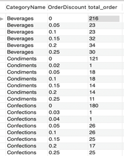

7.	What are the 5 most popular products? How many times a product get purchased[^7]
[^7]:Here is the list of how many times a product gets purchased. The top five products are product 59, 60, 31,24 and 56.
```
SELECT ProductID, ProductName, COUNT(DISTINCT(OrderID)) as total_order
FROM project
GROUP BY ProductID
ORDER BY total_order DESC;
```
<br />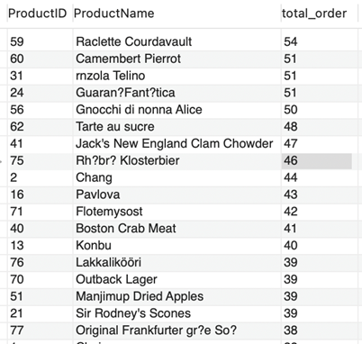

8.	Which supplier helps this company make the most profit?[^8]
[^8]:Aux joyeux eccl?iastiques helps this company make the most profit. It is the best partner. 
```
SELECT  SupplierName, ROUND(SUM(Subtotal),2) as Revenue
FROM project
GROUP BY SupplierName
ORDER BY Revenue DESC;
```
<br />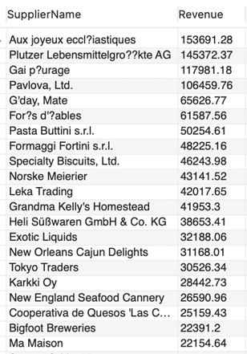

**----------------------------------- Data Visualization -----------------------------------**
<br />*Tableau document: [tb](https://github.com/HTean/Analysis/blob/main/Data2/Final_visualization.twb)*
*Dashboard Preview:*
<br />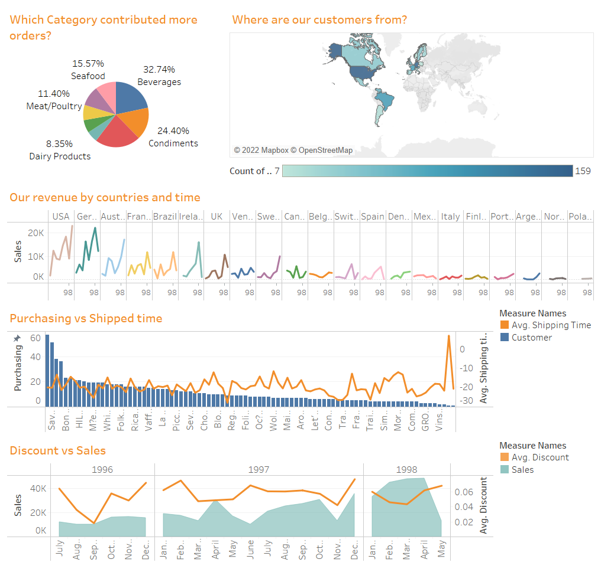
