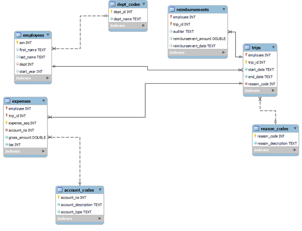
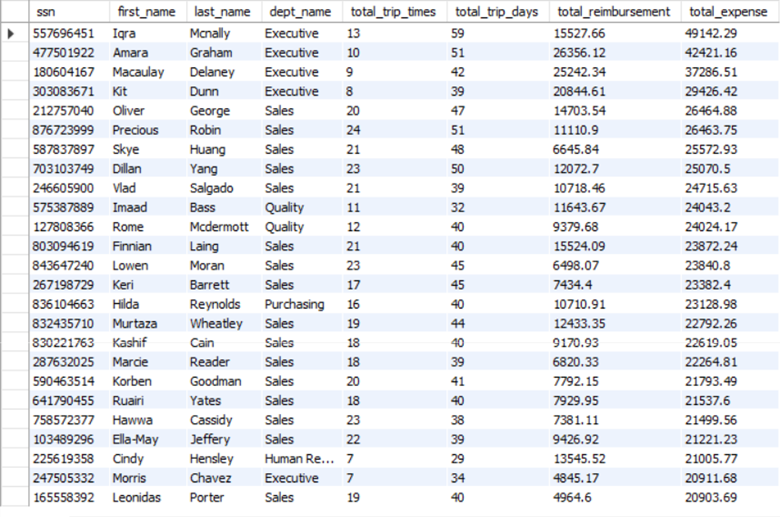
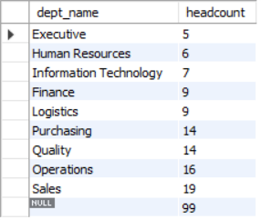
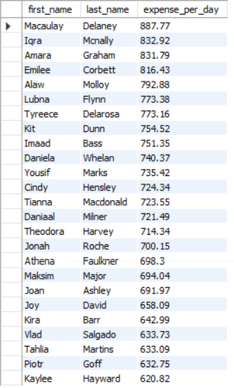

## SQL Practise - Company's Expediture Analysis

### ------------------------------------ Database ------------------------------------

*Database Creation: [db_create](https://www.example.com)*

- **This database contains 7 tables described below. The data contains a tracking system for expense reports filed by employees at a manufacturing company.**

| employees | Field Description |
| ----------- | ----------- |
| Ssn (pk) | Unique SSN ID# for employee |
| First_name | Employee first name |
| Last_name |	Employee last_name |
| Dept (fk) |	Dept ID# |
| Start_year | Year of employment |

| trips | Field Description |
| ----------- | ----------- |
| Employee (pk, fk) | SSN of employee travelling |
| Trip_ID (pk) |	Unique Trip ID# |
| Start_date |	Start date of trip |
| End_date |	End date of trip |
| Reason_code (fk)	| Code for reason for trip |

|expenses |	Field Description |
| ----------- | ----------- |
|Employee (pk, fk)|SSN of employee travelling|
|Trip_id (pk, fk)|Unique Trip ID# |
|Expense_seq (pk)|Sequence# for expense report line item |
|Account_no (fk)|	Account number for line item |
|Gross_amount |	Gross dollar amount of line item |
|tax |Sales tax (if applicable) of line item |
 	

|dept_codes |	Field Description |
| ----------- | ----------- |
|Dept_ID (pk)	|Dept ID# |
|Dept_name |	Name of department |


|Reason_codes |	Field Description |
| ----------- | ----------- |
|Reason_code (pk)|	Reason ID# |
|Reason_description 	|Description of reason for trip |
	
|account_codes |	Field Description |
| ----------- | ----------- |
|Account_no (pk)	|Account ID# |
|Account_description |	Description of account |
|Account_type |	Category of account |

|reimbursements |	Field Description |
| ----------- | ----------- |
|Employee (pk, fk)	|SSN of employee travelling |
|Trip_id (pk, fk)|	Unique Trip ID# |
|Auditor |	Auditor last name |
|Reimbursement_amount |	Amount of reimbursement |
|Reimbursement_date|Date of reimbursement |

- **The Schema looks like this**



### ------------------------------------ Analysis: ETL & Queries ------------------------------------

- **Design and create a data warehouse for the Expense database**
```
USE expense;

-- DW Creation

CREATE OR REPLACE VIEW dw AS
SELECT ssn, first_name, last_name, dept_name, COUNT(trip_id) AS total_trip_times,
       total_trip_days, ROUND(total_reimbursement,2) AS total_reimbursement, 
       ROUND(total_expense,2) AS total_expense
FROM trips 
    JOIN   ( SELECT employees.ssn, first_name, last_name, dept_name
             FROM employees JOIN dept_codes ON employees.dept = dept_codes.dept_id
		   ) AS employeeInfo
		ON trips.employee = employeeInfo.ssn
    JOIN   ( SELECT employee, SUM(DATEDIFF(STR_TO_DATE(end_date, '%m/%d/%Y'), 
                              STR_TO_DATE(start_date, '%m/%d/%Y'))) AS total_trip_days
             FROM trips
             GROUP BY employee
		    ) AS tripDays 
	    ON trips.employee = tripDays.employee
    JOIN    ( SELECT employee, SUM(reimbursement_amount) AS total_reimbursement
              FROM reimbursements
              GROUP BY employee
			) AS tripReimbursements
		ON trips.employee = tripReimbursements.employee
	JOIN    ( SELECT employee, SUM(gross_amount) AS total_expense
              FROM expenses
              GROUP BY employee
			) AS tripExpense
		ON trips.employee = tripExpense.employee
GROUP BY ssn
ORDER BY total_expense DESC, total_reimbursement DESC;

-- Display first 25 rows

SELECT * FROM expense.dw LIMIT 25;
```
*Data warehouse screenshot:*


- **Create four SQL queries on your data warehouse that answer interesting questions**
1. Q1: How many employees in each department?[^1]
[^1]:My 1st question is about to see what’s the headcount for each department and the firm.
<br />I found that the firm has 99 employees and sales department has the most employees.

```
-- Q1: How many employees in each department?
SELECT dept_name, COUNT(ssn) AS headcount
FROM dw
GROUP BY dept_name
WITH ROLLUP
ORDER BY headcount; 
```
*Query 1 screenshot:*
<br />

2. Q2: Who traveled the most and how many times?[^2]
[^2]: My 2nd question is to show me who traveled the most in the firm.
<br />I found that Precious Robin Traveled the most, which is 24 times in total.

```
-- Q2: Who traveled the most and how many times?
SELECT first_name, last_name, total_trip_times
FROM dw
ORDER BY total_trip_times DESC
LIMIT 1;
```
*Query 2 screenshot:*
<br />

3. Q3: What's the average reimbursement for each department?[^3]
[^3]:My 3rd question tells me average reimbursement of every department
<br />It shows that executive have highest average reimbursement, almost double the sales department, which is the second place.

```
-- Q3: What's the average reimbursement for each department?
SELECT dw.dept_name, headcount, ROUND(SUM(total_reimbursement),2) AS total_reimbursement,
       ROUND(SUM(total_reimbursement)/headcount,2) AS average_reimbursement
FROM dw
    JOIN ( SELECT dept_name, COUNT(ssn) AS headcount
           FROM dw
           GROUP BY dept_name
           ORDER BY headcount DESC
		 ) Q1
	  ON dw.dept_name = Q1.dept_name
GROUP BY dept_name
ORDER BY average_reimbursement DESC;
```
*Query 3 screenshot:*
<br />

4. Q4: Who's expense is higher than average expense per day?[^4]
[^4]:My last question aims to show employees who have expenses higher than average
<br />From the result I found that 38 out of 99 employees have higher expense, Macaulay Delaney is the highest.

```
SELECT first_name, last_name, ROUND(expense_per_day,2) AS expense_per_day
FROM  ( SELECT first_name, last_name, total_expense/total_trip_days AS expense_per_day, average_expense_per_day
        FROM dw 
		JOIN ( SELECT SUM(total_expense)/SUM(total_trip_days) AS average_expense_per_day FROM dw 
			 ) AS avgExpense ) AS dailyExpense
WHERE expense_per_day > average_expense_per_day
ORDER BY expense_per_day DESC;
```
*Query 4 screenshot:*
<br />
